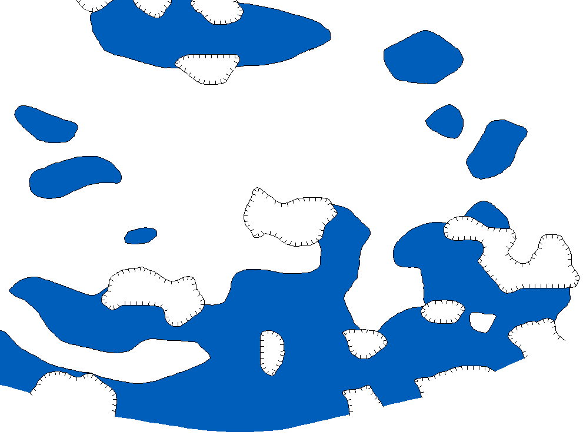
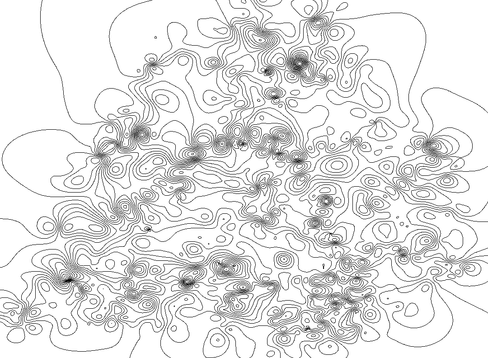

## Voronoi diagrams

Based on simple iterative method of triangulation. Complexity in worse case is O(N^2), 
in avgerange, O(N^3/2).


Data structures

```
TVertex = record
  x, y: Float;
end;

TVertex3d = record
  x, y, z: Float;
end;

TContour = record
  Count: Integer;
  Hole: Boolean;
  Vertices: PVertexArray;
end;

TPolygon = record
  Count: Integer;
  Contours: PContourArray;
end;

TCell = record
  Polygon: TPolygon;
  Vertex: TVertex;
  Value: Float;
end;

TRectFloat = record
  case Boolean of
    True: (left, top, right, bottom: Float);
    False:(TopLeft, BottomRight: TVertex);
end;
```
Main function
```
function VoronoiDiagrams(
  const Points: PVertex3dArray;  { Array of initial 3D points }
  const PointCount: Integer;     { Lenght of the points array }
  var Cells: PCellArray;         { Array of Voronoi diagrams to build  (return value) }
  var CellCount: Integer;        { Length of the cells array  (return value) }
  const Rct: PRectFloat          { Bounding box to clip infinite cells }
): Boolean;
```

## United Voronoi diagrams

Let we have some map


Voronoi diagrams built on that values are


After merging neighbouring cells that have the same values, we get United Voronoi diagrams


Smoothing methods
```
smNone       -- Not smooth  
smAvg        -- Averange method
smMiddle     -- Middle line method
smGaussian   -- Gaussian kernel method
smParabolic  -- Parabolic splines
smBSplines   -- B-Splines
smBezier,    -- Bezier method
smCubic      -- Cubic splines
smCatmullRom -- Catmull Rom splines
```
Main function
```
function UnitedVoronoiDiagrams(
  const Points: PVertex3dArray;  { Array of initial 3D points }
  const PointCount: Integer;     { Lenght of the points array }
  var Cells: PCellArray;         { Array of Voronoi diagrams to build  (return value) } 
  var CellCount: Integer;        { Length of the cells array  (return value) }
  const Rct: PRectFloat;         { Bounding box to clip infinite cells }
  SmoothMethod: Integer          { Smothing method of the merged edges }
): Boolean;
```
Smoothed version of the United Voronoi diagrams look like


## Grid clipping

Mark grid nodes as 1 if a node in the polygon, and 0 otherwise. Complexity is O(N + MlogM),
where N -- grid nodes, M -- polygon points.

Main function

```
function GridInPolygon(
  Polygon: PPolygon;             { Clipping polygon (can contain holes) }
  X, Y: PFloatArray;             { Array of X and Y coordinates respectively }
  CountX, CountY: Integer;       { Length of the X and Y arrays respectively }
  Grid: P2dByteArray;            { Grid bitmap (return value) }
  bBounded: Boolean              { Take into account edge intersections or not }
): Boolean;
```

Red grid nodes are inside the polygon, blacks, outside (in holes)


## Find cycles of intersecting contours

Given a set of properly directed contours, the algorithm finds all cycles and returns 
a result polygon (set of contours and holes). The complexity is O(NlogN).



Blue regions are the result polygons, the white zones inside, holes. The border of the each 
polygon comprises of the parts of the original contours. In case of the last closing contour 
has wrong direction the cycle is considered not found, there must be applied some kind of 
direction tolernt algorithm, f.e. based on triangulation or other methods.

This is some variation of "Line Segment Intersection Using a Sweep Line Algorithm" followed by 
"Donald B. Johnson, Finding all the elementary circuits of a directed graph".

## Build isolines and isocontours

Given 2D irregular grid (surface) defined by 1D arrays of X, Y, and 2D array of Z values. 
For each min(Z) <= Z' <= max(Z) value builds isolines or isocontours (closed version of 
isolines) depending on if bClosure flag of `CreateIsolines` function is set. 

How to use

1. Initialize a gid and internal control structures, i.e. call `InitializeIsolines`.
2. For each Z from [min(Z), max(Z)] call `CreateIsolines`. If you want just isolines 
   set `bClosure` to `False`, otherwise, `True`.
3. Release the grid and all resources, i.e. call `ReleaseIsolines`.


