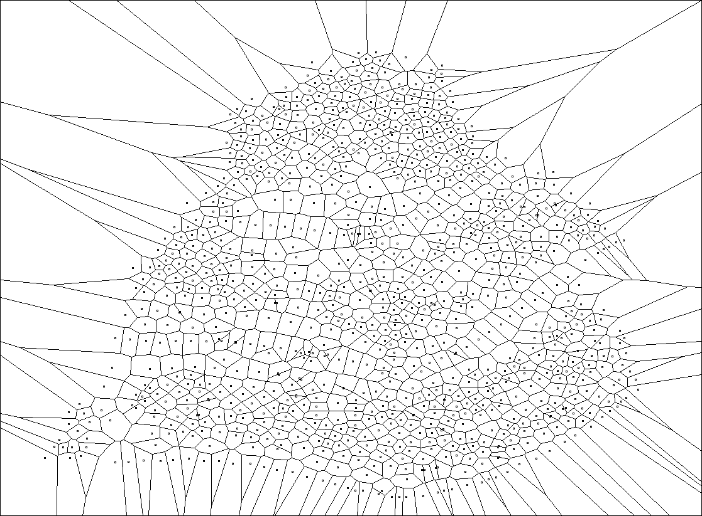
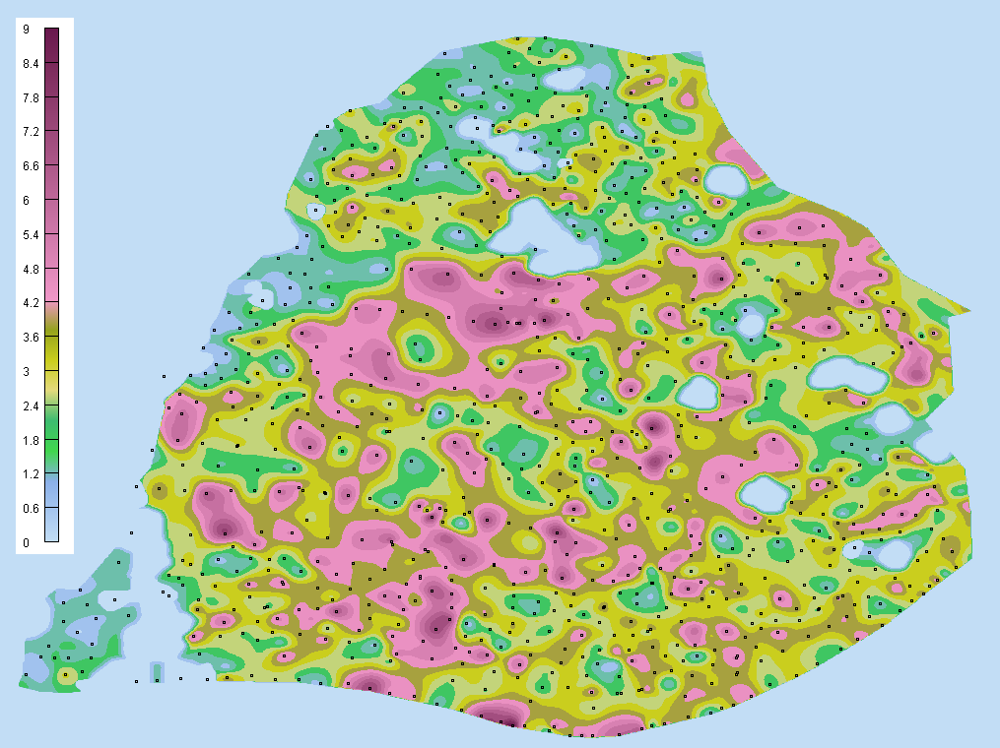
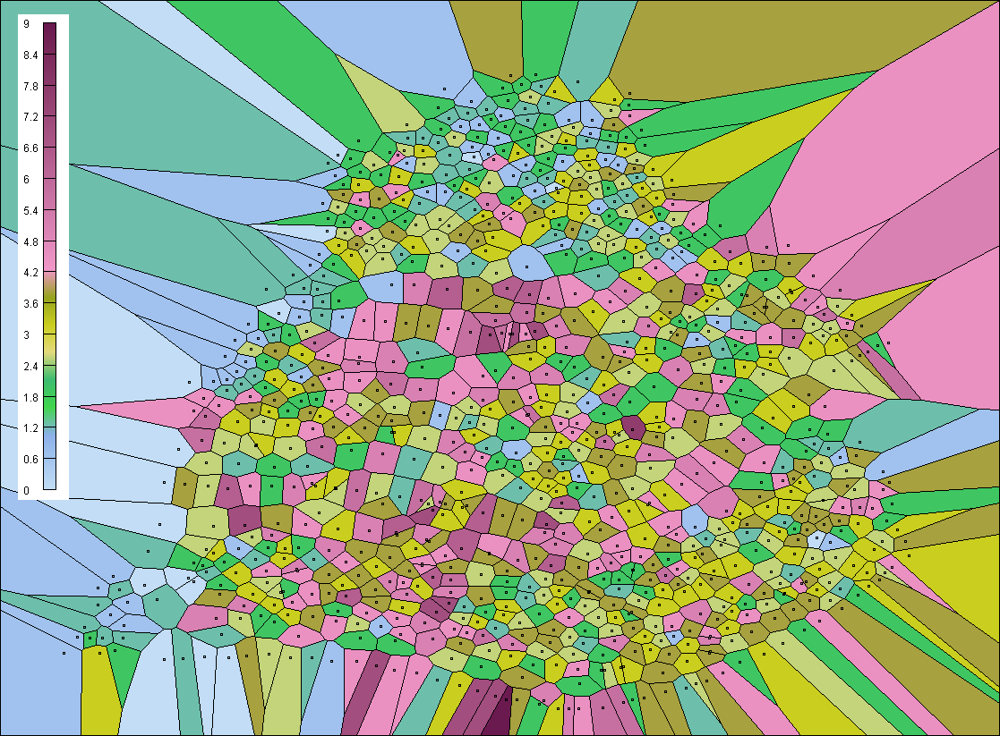
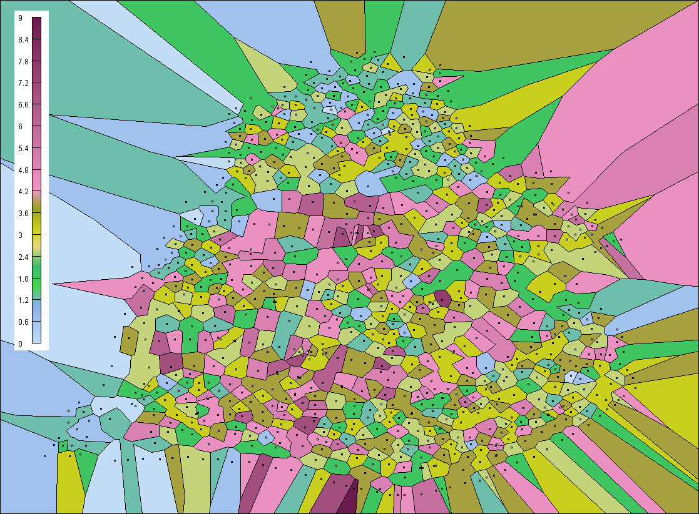
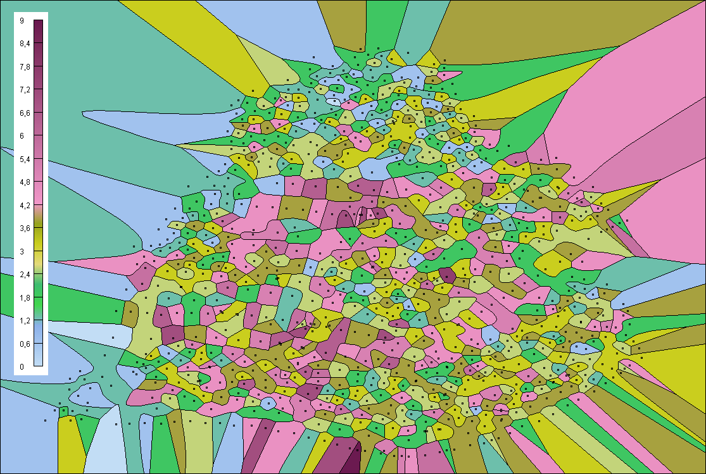
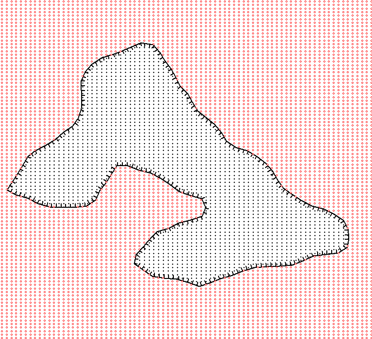

## Voronoi diagrams

Based on simple iterative method of triangulation. Complexity in worse case is O(N^2), 
in avgerange, O(N^3/2).



Data structures

```
TVertex = record
  x, y: Float;
end;

TVertex3d = record
  x, y, z: Float;
end;

TContour = record
  Count: Integer;
  Hole: Boolean;
  Vertices: PVertexArray;
end;

TPolygon = record
  Count: Integer;
  Contours: PContourArray;
end;

TCell = record
  Polygon: TPolygon;
  Vertex: TVertex;
  Value: Float;
end;

TRectFloat = record
  case Boolean of
    True: (left, top, right, bottom: Float);
    False:(TopLeft, BottomRight: TVertex);
end;
```
Main function
```
function VoronoiDiagrams(
  const Points: PVertex3dArray;  { Array of initial 3D points }
  const PointCount: Integer;     { Lenght of the points array }
  var Cells: PCellArray;         { Array of Voronoi diagrams to build  (return value) }
  var CellCount: Integer;        { Length of the cells array  (return value) }
  const Rct: PRectFloat          { Bounding box to clip infinite cells }
): Boolean;
```

## United Voronoi diagrams

Let we have some map



Voronoi diagrams built on that values are



After merging neighbouring cells that have the same values, we get United Voronoi diagrams



Smoothing methods
```
smNone       -- Not smooth  
smAvg        -- Averange method
smMiddle     -- Middle line method
smGaussian   -- Gaussian kernel method
smParabolic  -- Parabolic splines
smBSplines   -- B-Splines
smBezier,    -- Bezier method
smCubic      -- Cubic splines
smCatmullRom -- Catmull Rom splines
```
Main function
```
function UnitedVoronoiDiagrams(
  const Points: PVertex3dArray;  { Array of initial 3D points }
  const PointCount: Integer;     { Lenght of the points array }
  var Cells: PCellArray;         { Array of Voronoi diagrams to build  (return value) } 
  var CellCount: Integer;        { Length of the cells array  (return value) }
  const Rct: PRectFloat;         { Bounding box to clip infinite cells }
  SmoothMethod: Integer          { Smothing method of the merged edges }
): Boolean;
```
Smoothed version of the United Voronoi diagrams look like



## Grid clipping

Mark grid nodes as 1 if a node in the polygon, and 0 otherwise. Complexity is O(N + MlogM),
where N -- grid nodes, M -- polygon points.

Main function

```
function GridInPolygon(
  Polygon: PPolygon;             { Clipping polygon (can contain holes) }
  X, Y: PFloatArray;             { Array of X and Y coordinates respectively }
  CountX, CountY: Integer;       { Length of the X and Y arrays respectively }
  Grid: P2dByteArray;            { Grid bitmap (return value) }
  bBounded: Boolean              { Take into account edge intersections or not }
): Boolean;
```

Red grid nodes inside the polygon, black, outside (in holes)



